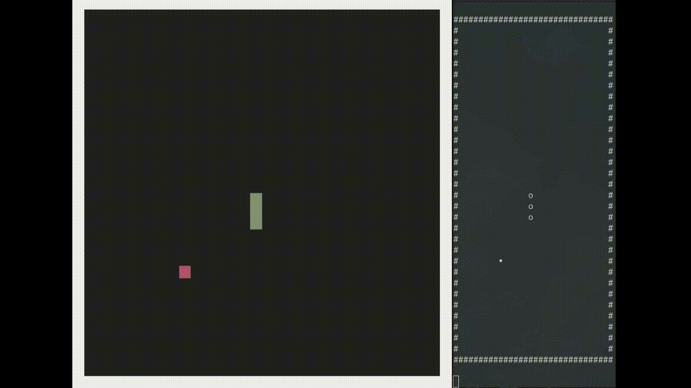

# Project Generative Neural Rendering (Work in Progress)

[Deep Learning Super Sampling (DLSS) 4 - Multi Frame Generation](https://www.youtube.com/watch?v=qQn3bsPNTyI&t=7s)
elevates Neural Rendering to a new level combining super resolution (times 2 per axis) + 3 generated frames in between each frame
15/16 pixels are generated by AI. This equals to **93.75%** of what is shown to the player!

But what if we can push this up to 100%?
What if we do not need to render the game traditionally any longer?

With this project I want to explore this idea.



## Idea

Other work in this field like [Game'n'Gen](https://arxiv.org/abs/2408.14837) and [PlayGen](https://arxiv.org/abs/2412.00887)
utilizes a stable diffusion network and feed the game state as semantic vector to generate the game.

I propose a different idea, what if the game is internally rendered in a simplified version like ASCII and works completely on their own.
We then use the simplified visualization and feed that into a network to generate the complex visualization.


Instead of abstracting the game and its logic and let the diffusion network embeed (and therefore learn) the game,
we generate the ASCII representation of the game and feed that either into the traditional rendering pipeline (OpenGL) or
our neural network to generate an image representation of our game.
We only use it as a different visualization method and let the game engine still handle the logic.

## Application

Here is a quick overview of how the application works:


The application first pools the input ([GLFW](https://github.com/glfw/glfw)) and the game reacts to it and produces an 
ASCII-string based on the current game state. This game state then can either be fed to a traditional [OpenGL](https://www.opengl.org/) renderer or
our neural renderer.

At the moment the renderer can be switched at runtime. (Next to have a real GUI to see both rendered side by side.)

## Neural Renderer


The ASCII string is first transformed into a 2-dim tensor grid and further processed through a one hot encoding.
Meaning every character representation (snake, wall, pellet, ground) gets its own 2D layer, increasing the tensor from 32 x 32 x 1 to 32 x 32 x 4.
This input is then given to our very simple neural network (a simple CNN atm. since we only need to learn a simple character to color mapping) 
and produces our neural buffer, containing an RGB frame.

## Data Generation

To train our neural network we have to generate some data.


While playing the game I added a serializer function to save the generated ASCII-string as a .txt file and the OpenGL frame buffer as .png file.
Files are saved with a uniform naming convention (ex. 0001.txt, 0001.png).
The data can be generated simply while "playing" the game.

The train, validate and test split is 1000 : 200 : 100 data points.

## Training the network

The network training is done completely in Python with PyTorch:


The whole trainings process is visualized via tensorboard.

Trained neural network models (.pth files) can be converted to be usable in C++ via the PyTorch C++ API (.pt files).  
And can be utilized in our C++ application.

## How to install

Here's a short explanation how to get the code running on your machine.
Of course clone the repo ```git clone https://github.com/BrandnerKasper/FusionEngine.git``` or download the .zip.
In the following I will explain how to get the Python and C++ code running.

### Python

Install a modern Python version like 3.12.
Use pip or conda to create a virtual environment.
Install dependencies based on requirements.txt file.

Via pip:
```console
pip install -r /path/to/requirements.txt
```

Via Conda:
```console
conda install --yes --file requirements.txt
```

I used generic torch and torch vision packages (as on my machine I am using the rocm version, because I have an AMD GPU).
Feel free to use the CUDA version or the CPU version based on this [website](https://pytorch.org/get-started/locally/) and your OS.

### C++

Most dependencies should be solved via running the CMakeLists.txt file. (I am using CLion and the integrated CMake functionality, so no console commands here!)
There are two exceptions to this rule:
- [GLAD](https://glad.dav1d.de/) has to be specifially chosen based on your OS and hardware configuration. 
A good explanation is given [here](https://learnopengl.com/Getting-started/Creating-a-window).
Use version 4.6 and put the downloaded extraced folder into the extern folder ```FusionEngine/code/C++/extern```.
- [Pytorch C++](https://pytorch.org/get-started/locally/) download the PyTorch library depending on your OS/hardware from the linked website and put the folder into ```FusionEngine/code/C++/extern``` again. 

At this point you should be set up, all dependencies are resolved and the code should compile.
If not feel free to write me an angry mail, I will update this section accordingly.